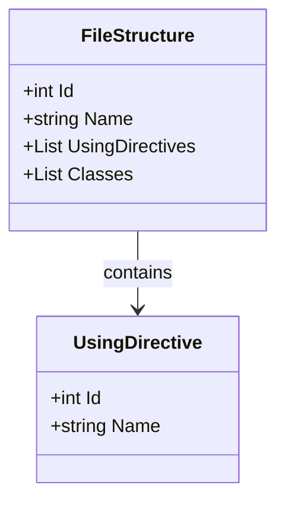
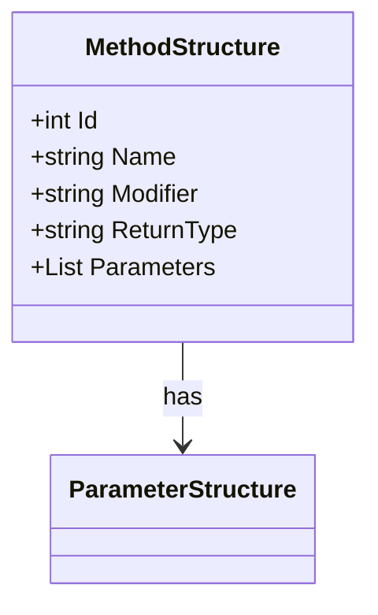

# Class Diagram Generation Rules

When asked to generate a class diagram from the `cod8a` JSON output, follow these rules to produce valid Mermaid `classDiagram` syntax.

## JSON Structure

The JSON output contains a hierarchical structure:
*   `Files`: A list of file objects.
    *   `Classes`: A list of class objects within each file.
        *   `Name`: The class name.
        *   `Fields`: A list of field objects.
            *   `Modifier`: Access modifier (e.g., "public", "private").
            *   `Type`: The data type.
            *   `Name`: The field name.
        *   `Methods`: A list of method objects.
            *   `Modifier`: Access modifier.
            *   `ReturnType`: The return type.
            *   `Name`: The method name.
            *   `Parameters`: A list of parameter objects (`Type` and `Name`).

## Conversion Rules

1.  **Start:** Begin the code block with `classDiagram`.
2.  **Classes:** For each class in the JSON, declare the class: `class ClassName {`
3.  **Fields:** Inside the class block, list fields. Map C# modifiers to UML symbols:
    *   `public` -> `+`
    *   `private` -> `-`
    *   `protected` -> `#`
    *   Format: `[UML_Modifier][Type] [Name]` (e.g., `+string Name`)
4.  **Methods:** Inside the class block, list methods. Map modifiers similarly.
    *   Format: `[UML_Modifier][ReturnType] [Name]` if parameters are not shown, or use standard Mermaid method syntax.
    *   Note: Based on the requested style, use: `[UML_Modifier][ReturnType] [Name]`
5.  **Relationships:** Represent relationships using arrows with labels:
    *   Association with label: `ClassA --> ClassB : label`
    *   Example: `FileStructure --> ClassStructure : contains`

## Example

**Target Style (from sample):**

**Conversion Example:**
If the JSON has a class `MethodStructure` with a list of `ParameterStructure`:

