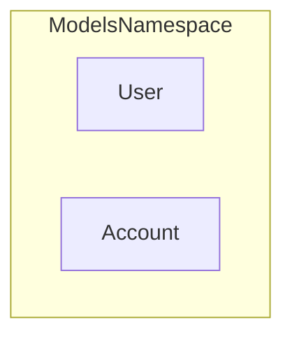

# Flowchart Generation Rules

When asked to generate a flowchart from the `cod8a` JSON output, follow these rules to produce valid Mermaid `graph` (or `flowchart`) syntax.

## JSON Structure

The JSON output contains a hierarchical structure:
*   `Files`: A list of file objects, representing namespaces or physical files.
    *   `Name`: The file/namespace name.
    *   `Classes`: A list of class objects within each file.
        *   `Name`: The class name.

## Conversion Rules

1.  **Start:** Begin the code block with `graph TD` (Top-Down orientation) or `flowchart TD`.
2.  **Subgraphs (Namespaces/Files):** Represent each file or namespace as a subgraph to group related classes.
    ```mermaid
    subgraph File_Namespace_Name
    ```
3.  **Nodes (Classes):** Inside the subgraph, represent each class as a node.
    ```mermaid
        ClassName[ClassName]
    ```
4.  **Close Subgraph:** End the subgraph block.
    ```mermaid
    end
    ```

## Example

**JSON Snippet:**
```json
{
  "Files": [
    {
      "Name": "ModelsNamespace",
      "Classes": [
        {"Name": "User"},
        {"Name": "Account"}
      ]
    }
  ]
}
```

**Mermaid Output:**

