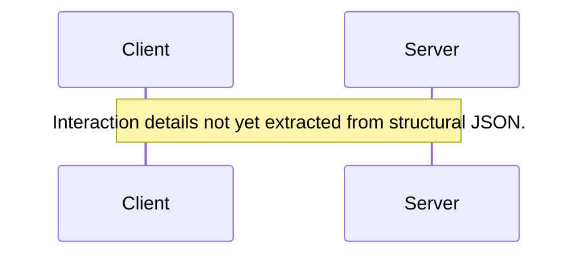

# Sequence Diagram Generation Rules

When asked to generate a sequence diagram from the `cod8a` JSON output, follow these rules to produce valid Mermaid `sequenceDiagram` syntax.

*Note: Generating a complete sequence diagram from static structure JSON is challenging. The focus here is on establishing the participants based on the available classes.*

## JSON Structure

The JSON output contains a hierarchical structure:
*   `Files`: A list of file objects.
    *   `Classes`: A list of class objects within each file.
        *   `Name`: The class name.

## Conversion Rules

1.  **Start:** Begin the code block with `sequenceDiagram`.
2.  **Participants:** Declare each class found in the JSON as a participant.
    ```mermaid
    participant ClassName
    ```
3.  **Interactions (Placeholder):** Since method body execution flow is not typically in the structural JSON, add a placeholder note indicating that detailed interactions need manual specification.
    ```mermaid
    Note over Participant1, Participant2: Interaction details not yet extracted from structural JSON.
    ```

## Example

**JSON Snippet:**
```json
{
  "Files": [
    {
      "Classes": [
        {"Name": "Client"},
        {"Name": "Server"}
      ]
    }
  ]
}
```

**Mermaid Output:**

